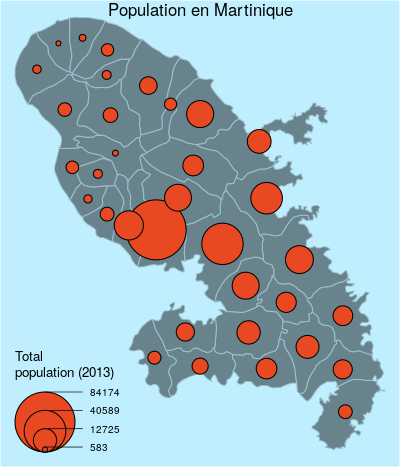
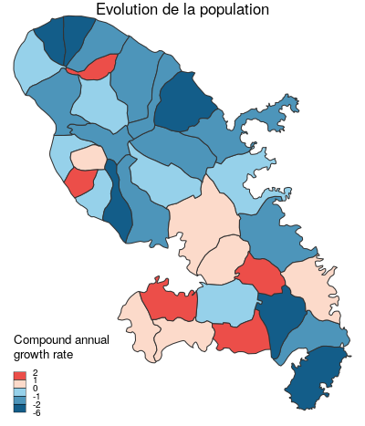
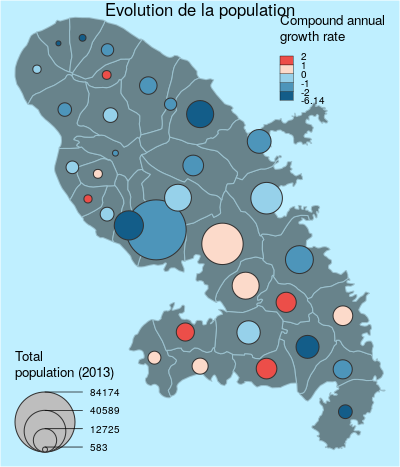
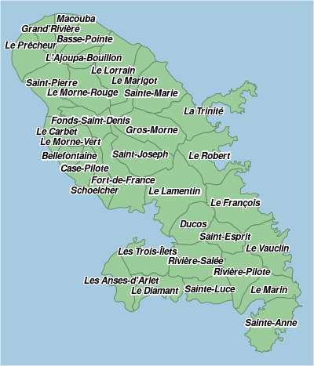
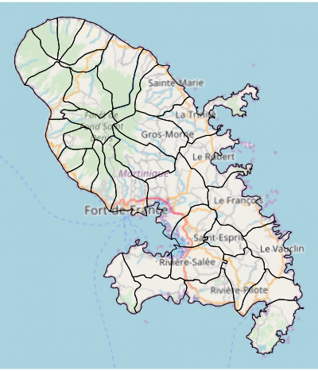
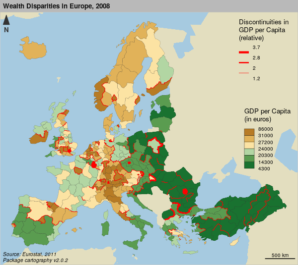
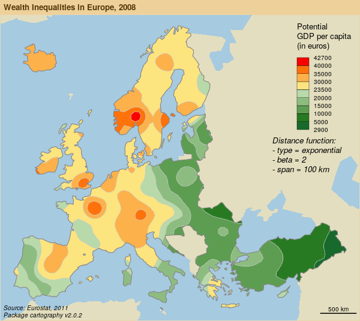

```{r knitr_init, echo=FALSE, cache=FALSE}
library(knitr)
## Global options
options(max.print="90")
opts_chunk$set(echo=TRUE,
	             cache=TRUE,
               prompt=FALSE,
               tidy=FALSE,
               comment=NA,
               message=FALSE,
               warning=FALSE)
opts_knit$set(width=90)
options(width = 90)


knit_hooks$set(nm = function(before, options, envir){
  if (before){
    par(mar=c(0,0,0,0))
  } 
})

knit_hooks$set(sm = function(before, options, envir){
  if (before){
    par(mar=c(0,0,1.2,0))
  } 
})


```


# "La science est infaillible,<br/>mais les savants se trompent toujours."<br/><small><small>Anatole France, 1889</small></small><br/>


## La recherche reproductible

* Les sciences se reposent sur le principe de reproductibilité.

* La reproductibilité est un élément permettant d'évaluer la validité des résultats.

* En sciences sociales, l'utilisation de l'informatique facilite la reproductibilité. 


 
## Le spectre de la reproductibilité


<small>Peng, 2011</small>
</br>

Accompagner les publications scientifiques des jeux de données et codes sources pour permettre aux collègues de reproduire les résultats.


## Cartographie reproductible ?

Les cartes, comme les autres production graphiques ou statistiques sont des éléments à part entière des études scientifiques.


## Cartographie reproductible ?

- Garder une trace cohérente des traitements effectués  
- Partager ses méthodes  
- Etre transparent, s'exposer à la critique  
- Faciliter les mises à jour  
- Travailler collectivement  
- Automatiser des taches  
- Lier fortement l'analyse et la représentation  


## Cartographie reproductible ? {data-transition="convex-in fade-out"}

  
La grande majorité des cartes produites dans un contexte académique sont issues de processus complexes. Elles sont donc souvent produites en utilisant une grande variété de logiciels et de formats.


## Cartographie reproductible ?  {data-transition="fade-in fade-out"}

  
Cette variété de formats et de logiciels rend difficile la reproduction des cartes.

## Cartographie reproductible ! {data-transition="fade-in convex-out"}


Simplifier les chaines de traitement pour couvrir les différentes étapes de la construction cartographique.


# Les fonctionnalités spatiales de R<br/>


## Les packages historiques

* `rgdal` : interface entre R et les librairies GDAL ([Geospatial Data Abstraction Library](http://www.gdal.org/)) et [PROJ4](https://github.com/OSGeo/proj.4).

* `sp` : classes et methodes pour les données spatiales dans R.

* `rgeos` : accès à la librairie d'opérations spatiales GEOS ([Geometry Engine - Open Source](http://trac.osgeo.org/geos/)) :  area, perimeter, distances, dissolve, buffer, overlap, union, contains...


## Le package sf

* Les fonctionnalités de `sp`, `rgeos` et `rgdal` dans un package unique. 

* Manipulation plus aisée, objets plus simples

* Auteur principal et *maintainer* : Edzer Pebesma (auteur de `sp`)

* Compatible avec les syntaxes *pipe* et les opérateurs du `tidyverse`.


## Le package sf

Format des objets spatiaux `sf`


## Le package sf

Import de données

```{r}
library(sf)
mtq <- st_read("data/martinique.shp")
```


## Le package sf

Affichage de données

```{r, fig.height=3, fig.width=3, nm=TRUE}
plot(st_geometry(mtq))
```


## Le package sf

Extraire les centroïdes

```{r,  fig.height=3, fig.width=3, nm=TRUE}
mtq_c <- st_centroid(mtq)
plot(st_geometry(mtq))
plot(st_geometry(mtq_c), add=TRUE, cex=1.2, col="red", pch=20)
```


## Le package sf

Construire une matrice de distances

```{r,  fig.height=3, fig.width=3, nm=TRUE}
mat <- st_distance(x=mtq_c,y=mtq_c)
mat[1:5,1:5]
```


## Le package sf

Agréger des polygones
```{r,  fig.height=3, fig.width=3, nm=TRUE}
mtq_u <- st_union(mtq)
plot(st_geometry(mtq), col="lightblue")
plot(st_geometry(mtq_u), add=T, lwd=2, border = "red")
```


## Le package sf

Construire une zone tampon

```{r,  fig.height=3, fig.width=3, nm=TRUE}
mtq_b <- st_buffer(x = mtq_u, dist = 5000)
plot(st_geometry(mtq), col="lightblue")
plot(st_geometry(mtq_u), add=T, lwd=2)
plot(st_geometry(mtq_b), add=T, lwd=2, border = "red")

```


## Le package sf

Réaliser une intersection 

```{r,  fig.height=3, fig.width=3, nm=TRUE}
m <- rbind(c(700015,1624212), c(700015,1641586), c(719127,1641586), c(719127,1624212), c(700015,1624212))
p <- st_sf(st_sfc(st_polygon(list(m))), crs = st_crs(mtq))
plot(st_geometry(mtq))
plot(p, border="red", lwd=2, add=T)
```


## Le package sf

Réaliser une intersection 

```{r,  fig.height=3, fig.width=3, nm=TRUE, warning=F}
mtq_z <- st_intersection(x = mtq, y = p)
plot(st_geometry(mtq))
plot(st_geometry(mtq_z), col="red", border="green", add=T)
```


## Le package sf

Construire des polygones de Voronoi
<small>google: "st_voronoi R sf" (https://github.com/r-spatial/sf/issues/474 & https://stackoverflow.com/questions/45719790/create-voronoi-polygon-with-simple-feature-in-r)
</small>
```{r,  fig.height=3, fig.width=3, nm=TRUE}
mtq_v <- st_voronoi(x = st_union(mtq_c))
mtq_v <- st_intersection(st_cast(mtq_v), st_union(mtq))
mtq_v <- st_join(x = st_sf(mtq_v), y = mtq_c, join=st_intersects)
mtq_v <- st_cast(mtq_v, "MULTIPOLYGON")
plot(st_geometry(mtq_v), col='lightblue')
```


# Le package cartography  {data-background="./img/computerrage.gif"}


## Symboles proportionnels

<small>
```{r propS, echo=TRUE, eval=TRUE, prompt=FALSE, message=FALSE, results='hide'}
library(cartography)
library(sf)
# Load data
mtq <- st_read(system.file("shape/martinique.shp", package="cartography"))
# save map
png(filename = "img/map1.png", width = 400, height = 467, res = 100)
# ser margins
par(mar=c(0,0,0,0))
# Countries plot
plot(st_geometry(mtq), col = "lightblue4",
     border = "lightblue3", bg = "lightblue1")
# Population plot on proportional symbols
propSymbolsLayer(x = mtq, 
                 var = "P13_POP", 
                 legend.title.txt = "Total\npopulation (2013)")
# Title
mtext(text = "Population en Martinique", side = 3, line = -1)
dev.off()
#                                                                                         .
```
</small>


## Symboles proportionnels



## Carte choroplèthe
<small>
```{r choro, echo=TRUE, eval=TRUE, prompt=FALSE, message=FALSE, results='hide'}
png(filename = "img/map2.png", width = 400, height = 467, res = 100)
# Compute the compound annual growth rate
mtq$cagr <- (((mtq$P13_POP / mtq$P08_POP)^(1/4)) - 1) * 100
# set margins
par(mar=c(0,0,0,0))
# Map plot
choroLayer(x = mtq, 
           var = "cagr", 
           breaks = c(-6.14,-2,-1,0,1,2),
           col = c("#135D89", "#4D95BA", "#96D1EA", "#FCDACA", "#EC4E49"),
           legend.title.txt = "Compound annual\ngrowth rate")
# Title
mtext(text = "Evolution de la population", side = 3, line = -1)
dev.off()


#                                                                                                         .
```
</small>

## Carte choroplèthe



## Palettes de couleurs


```{r pal, echo=TRUE, eval=TRUE, prompt=FALSE, message=FALSE, results='hide', fig.height=4}

display.carto.all(20)

```

## Palettes de couleurs


```{r pal1, echo=TRUE, eval=TRUE, prompt=FALSE, message=FALSE, results='hide', fig.height=4}

display.carto.pal("orange.pal")

```


## Palettes de couleurs


```{r pal2, echo=TRUE, eval=TRUE, prompt=FALSE, message=FALSE, results='hide', fig.height=3}
mypal <- carto.pal(pal1 = "wine.pal", n1 = 7, pal2 = "green.pal", n2 = 12,
                   middle = TRUE, transparency = TRUE)
k <- length(mypal)
image(1:k, 1, as.matrix(1:k), col=mypal, xlab = paste(k," classes",sep=""),
      ylab = "", xaxt = "n", yaxt = "n",bty = "n")

```

## Discrétisations

<small>
```{r disc2, fig.height=3}
var <- mtq$cagr
moy <- mean(var)
med <- median(var)
std <- sd(var)
# Quantile intervals
breaks <- getBreaks(v = var, nclass = 6, method = "quantile")
hist(var, probability = TRUE, breaks = breaks, main="quantiles",
     col = carto.pal(pal1 = "wine.pal",3, "green.pal", 3))
rug(var)
abline(v = med, col = "blue", lwd = 3)
```
</small>


## Discrétisations

<small>
```{r disc3, fig.height=3}
# Mean and standard deviation (msd)
breaks <- getBreaks(v = var, method = "msd", k = 1, middle = TRUE)
hist(var, probability = TRUE, breaks = breaks, main="moyenne / écart-type",
     col = carto.pal(pal1 = "wine.pal",3 , "green.pal", 2, middle = TRUE))
rug(var)
abline(v = moy, col = "red", lwd = 3)
abline(v = moy + 0.5 * std, col = "blue", lwd = 3)
abline(v = moy - 0.5 * std, col = "blue", lwd = 3)
```
</small>


## Combinaisons 

<small>
```{r choroprop, echo=TRUE, eval=TRUE, prompt=FALSE, message=FALSE, results='hide'}
png(filename = "img/map3.png", width = 400, height = 467, res = 100)
# set margins
par(mar=c(0,0,0,0))
# Map plot
# Countries plot
plot(st_geometry(mtq), col = "lightblue4",
     border = "lightblue3", bg = "lightblue1")
propSymbolsChoroLayer(x = mtq, var= "P13_POP", 
                 legend.var.title.txt = "Total\npopulation (2013)",
           var2 = "cagr", legend.var.pos = "bottomleft", 
           breaks = c(-6.14,-2,-1,0,1,2),
           col = c("#135D89", "#4D95BA", "#96D1EA", "#FCDACA", "#EC4E49"),
           legend.var2.title.txt = "Compound annual\ngrowth rate")
# Title
mtext(text = "Evolution de la population", side = 3, line = -1)
dev.off()


#                                                                                                         .
```
</small>

## Combinaisons




## Labels

```{r labs, echo=TRUE, eval=TRUE, prompt=FALSE, message=FALSE, results='hide'}
png(filename = "img/map4.png", width = 400, height = 467, res = 100)
# set margins
par(mar=c(0,0,0,0))
plot(st_geometry(mtq), col = "darkseagreen3", 
     border = "darkseagreen4", 
     bg = "#A6CAE0")
labelLayer(x = mtq, txt = "LIBGEO", col= "black", cex = 0.7, font = 4,
           halo = TRUE, bg = "white", r = 0.1, 
           overlap = FALSE, show.lines = FALSE)
dev.off()

```


## Labels




## Tuiles OpenStreetMap

```{r osm, echo=TRUE, eval=FALSE, prompt=FALSE, message=FALSE, results='hide'}
png(filename = "img/map4bis.png", width = 400, height = 467, res = 100)
# set margins
par(mar=c(0,0,0,0))
tiles <- getTiles(x = mtq, type = "osm", crop=T)
tilesLayer(tiles)
plot(st_geometry(mtq), add=T)
dev.off()

```


## Tuiles OpenStreetMap




## Carte carroyée

<small>
```{r grid, echo=TRUE, eval=FALSE, prompt=FALSE, message=FALSE, results='hide'}
library(cartography)
data(nuts2006)
nuts3.spdf@data = nuts3.df
# Create a grid layer
mygrid <- getGridLayer(x = nuts3.spdf, cellsize = 100000 * 100000, 
                       type = "hexagonal", var = c("pop1999","pop2008"))
# Compute the compound annual growth rate
mygrid$cagr <- (((mygrid$pop2008/mygrid$pop1999)^(1/9)) - 1) * 100
v <- getBreaks(v = mygrid$cagr, method = "quantile", nclass = 10)
v[5] <- 0

# set a color palette
cols <- c("#f18b61", "#f7b48c", "#f3d9b7", "#f1eccd", 
          "#c0dec2", "#91caa4", "#63b285", "#329966", 
          "#26734d", "#1a4c33")

# save the map in png format
png(filename = "img/map5.png", width = 600, height = 535, res = 100)
par(mar = c(0, 0, 1.2, 0))
# Plot a background layers
plot(nuts0.spdf, border = NA, col = NA, bg = "#A6CAE0")
plot(world.spdf, col = "#CCCCCC", border = NA, add = TRUE)

# plot the choropleth grid
choroLayer(x = mygrid, var = "cagr", add = TRUE, 
           col = cols, lwd = 0.6, border = "#FFFFFF60", 
           legend.pos = "right", breaks = v, legend.values.rnd = 2, 
           legend.title.txt = "Compound Annual\nGrowth Rate")

# plot countries boundaries
plot(nuts0.spdf, add = T, col = NA, border = "#56514c", lwd = 0.7)

# Plot a layout
layoutLayer(title = "Demographic Trends, 1999-2008", 
            author = "Package cartography v2.0.2", 
            sources = "Source: Eurostat, 2011", frame = TRUE, 
            scale = 500, north = TRUE, theme = "taupe.pal")
dev.off()


#                                                                                                         .
```
</small>

## Carte carroyée


## Carte de discontinuités
<small>
```{r disc, echo=TRUE, eval=FALSE, prompt=FALSE, message=FALSE, results='hide'}
# Get a SpatialLinesDataFrame of countries borders
nuts2.contig <- getBorders(x = nuts2.spdf)
nuts2.df$gdpcap <- nuts2.df$gdppps2008/nuts2.df$pop2008 * 1e+06

# save the map in png format
png(filename = "img/map6.png", width = 600, height = 535, res = 100)
par(mar = c(0, 0, 1.2, 0))

# Plot a background layers
plot(nuts2.spdf, border = NA, col = NA, bg = "#A6CAE0")
plot(world.spdf, col = "#E3DEBF", border = NA, add = TRUE)

# Plot GDP per capita with a choropleth layer
choroLayer(spdf = nuts2.spdf, df = nuts2.df, var = "gdpcap", 
           border = "grey20", lwd = 0.2, 
           col = carto.pal(pal1 = "green.pal", n1 = 3, "sand.pal", 3), 
           method = "quantile", nclass = 6, add = TRUE, 
           legend.pos = "right", legend.values.rnd = -2, 
           legend.title.txt = "GDP per Capita\n(in euros)")

# Plot discontinuities
discLayer(x = nuts2.contig, df = nuts2.df, 
          var = "gdpcap", type = "rel", 
          method = "equal", nclass = 3, threshold = 0.4, 
          sizemin = 0.7, sizemax = 6, col = "red", 
          legend.values.rnd = 1, legend.pos = "topright", add = TRUE,
          legend.title.txt = 
            "Discontinuities in \nGDP per Capita\n(relative)")

# Layout
layoutLayer(title = "Wealth Disparities in Europe, 2008", 
            author = "Package cartography v2.0.2", 
            sources = "Source: Eurostat, 2011", frame = TRUE, 
            scale = 500, north = FALSE, theme = "grey.pal")
north(pos="topleft")
dev.off()


#                                                                                                         .
```
</small>


## Carte de discontinuités




## Lissage

<small>
```{r smooth, echo=TRUE, eval=FALSE, prompt=FALSE, message=FALSE, results='hide'}
# Create a grid layer
nuts3.spdf@data = nuts3.df
mygrid <- getGridLayer(x = nuts3.spdf, var = c("pop2008", "gdppps2008"),
                       cellsize = 50000 * 50000, type = "regular")

# transform gdp in euros
mygrid$gdppps2008 <- mygrid$gdppps2008 * 1e+06

# list of breaks
v <- c(2920, 5000, 10000, 15000, 20000, 23500, 30000, 35000, 40000, 42720)

# save the map to a png file
# save the map in png format
png(filename = "img/map7.png", width = 600, height = 535, res = 100)
par(mar = c(0, 0, 1.2, 0))

# Plot a background layers
plot(nuts0.spdf, border = NA, col = NA, bg = "#A6CAE0")
plot(world.spdf, col = "#E3DEBF", border = NA, add = TRUE)

# set a color palette
cols <- c(rev(carto.pal("green.pal", 5)), carto.pal("orange.pal", 4))

# compute & display the potential map
smoothLayer(x = mygrid, 
            var = "gdppps2008", var2 = "pop2008", breaks = v, 
            span = 1e+05, beta = 2, mask = nuts0.spdf, 
            resolution = 50000, col = cols, 
            legend.title.txt = "Potential\nGDP per capita\n(in euros)", 
            legend.values.rnd = -2, 
            border = "grey80", lwd = 0.5, add = T, legend.pos = "topright")

# plot Europe contour
plot(rgeos::gBuffer(nuts0.spdf, FALSE, 1), add = T, col = NA, 
     border = "grey50")

# plot a layout
layoutLayer(title = "Wealth Inequalities in Europe, 2008", 
            author = "Package cartography v2.0.2", 
            sources = "Source: Eurostat, 2011", frame = TRUE, 
            scale = 500, north = FALSE, theme = "sand.pal")

# plot a text on the map
text(x = 6271272, y = 3600000, 
     labels = "Distance function:\n- type = exponential\n- beta = 2\n- span = 100 km", 
     cex = 0.8, adj = 0, font = 3)

dev.off()


#                                                                                                         .
```
</small>


## Lissage




# Merci {data-transition="convex-in fade-out"}


## Merci {data-transition="fade-in fade-out"}
**Code & Présentation**  
https://github.com/riatelab/cartographie-reproductible  
<br/>
**cartography**  
Github: [https://github.com/riatelab/cartography](https://github.com/riatelab/cartography)  
CRAN: [https://cran.r-project.org/web/packages/cartography/](https://cran.r-project.org/web/packages/cartography/index.html)  
<br/>
**Blogs**  
neocarto: [neocarto.hypotheses.org](https://neocarto.hypotheses.org/)   
rgeomatic: [rgeomatic.hypotheses.org](https://rgeomatic.hypotheses.org/)

## sessionInfo()


```{r}
sessionInfo()
```


